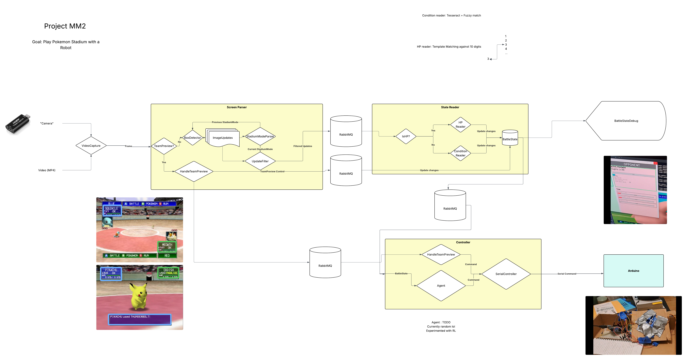

# Stadium AI

An AI system for Pokemon Stadium that can read game state from screen capture and make optimal move decisions using damage calculations and type effectiveness analysis.

## Features

- **Computer Vision**: Reads game state from Pokemon Stadium screenshots/video
- **State Management**: Tracks Pokemon stats, HP, status conditions, and battle state
- **Damage Calculation**: Uses Smogon damage calculator for accurate move damage prediction
- **Move Database**: Comprehensive move and Pokemon data configuration

## Diagram



## Install

### Prerequisites

- Python 3.x
- Node.js and npm
- OpenCV for Python
- PyTorch (for neural network models)

### Python Dependencies

```bash
pip install opencv-python torch torchvision numpy pyyaml
```

### Node.js Dependencies

```bash
npm install
```

This will install:
- @smogon/calc: For damage calculations
- js-yaml: For YAML configuration parsing
- pokemon-showdown: For Pokemon data
- commander: For CLI interface

### Additional Setup

1. Install Tesseract OCR for text recognition:
   ```bash
   # Ubuntu/Debian
   sudo apt-get install tesseract-ocr
   
   # macOS
   brew install tesseract
   ```

2. Ensure you have the required model files:
   - `cv/hp_cnn.pt` - CNN model for HP reading
   - `cv/mnist_cnn.pt` - CNN model for number recognition

## Run

### Basic Usage

1. Camera reading and box parsing

```bash
 python .\main.py --camera=0
```

2. Parsing and battle state update

```bash
python -m src.state_reader.state_reader --config .\config\pokemon_rental_teams.yaml
```

3. Setting up the Serial controller

```bash
python -m src.controller.controller_node  --port COM4
```

### Configuration

**TODO**

## Known Bugs

- **Partial Trapping Moves**: Partial trapping moves (like Bind, Fire Spin, etc.) are automatically assumed to be successful by the state_reader, which is not always the case. In actual gameplay, these moves can miss or fail to trap the opponent, but the current implementation assumes they always succeed when detected.
- **Incomplete Battle Information**: Current battle state has full information. Need a way to pass incomplete information to RL agent, since opponent's moves/mons are not known at the start of the battle.
- **Order may not be kept** Team preview button order might not be in the same as the order for choosing pokemon.
- **Accuracy is not tracked** Need to add accuracy boosts/debuffs
- **HP %/Raw mismatch** Should be %, but haven't incorporated max HP values in battle state yet.
- **Tracking should find most accurate in frame before adding to average filter**
- **Moves should decrement PP** 
- **Moves should set certain effects**:
   - Two-turn moves should deactivate two-turn status
- **Pokemon should be read from HP box, not from conditions** Condition messages are too volatile
- **BattleState corruption** Occasionally, the stats for the benched Pokemon are updated instead of the active one. Could be related to the bug above.
- **Separate finding possible moves from the RandomAgent** 
- **Debug UI only updates after state updates** (due to lack of understanding of multithreading in Python)
- **8 and 9 template images are corrupted** This results in weird behavior when at ex. 88 hp
- **HP outlier rejection / filtering** Currently, only the first HP result is recorded. Should attempt multiple recordings, and get the best guess from there.

## Project Structure

```
├── examples/           # Examples for running modules in isolation.
├── src/                # Core source code
   |── concurrent       # Not used
   |── controller       # Code that handles the agent + output to serial
   |── display          # Utils for displaying state + updates
   |── params           # Handles parameter loading (usually from YAML)
   |── rabbitmq         # RabbitMQ wrapper code.
   |── screen_parsing   # Detects the boxes and Stadium mode
   |── state            # Holds BattleState, convenience enums / typedefs
   |── state_reader     # Text parsing + state update
   |── utils            # Misc. utils
├── config/             # Pokemon and move configurations 
├── test/               # Test files
```

## Contributing

1. Fork the repository
2. Create a feature branch
3. Make your changes
4. Add tests if applicable
5. Submit a pull request

## License

ISC License - see the package.json for details.
